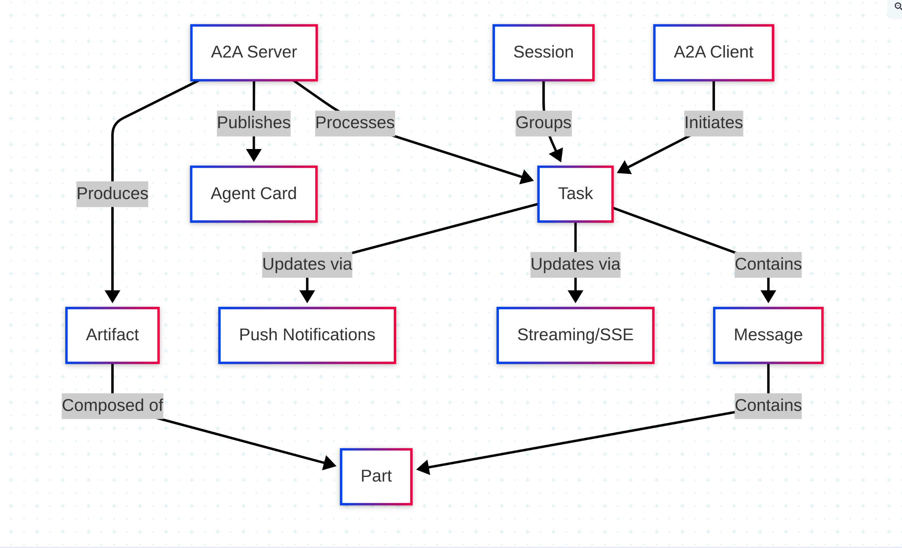
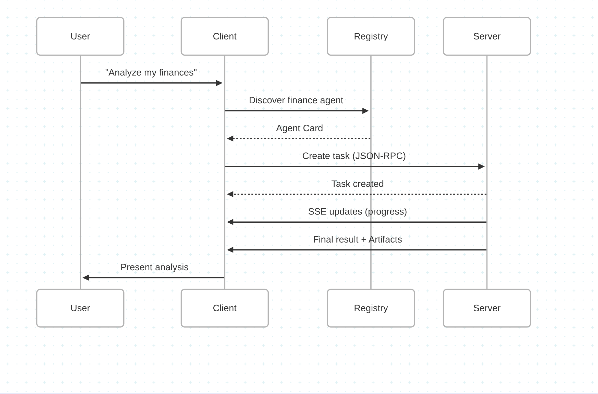

<!-- _class: lead -->
# The A2A Protocol
## Powering the Next Generation of Multi-Agent Systems

<div class="highlight text-center">
An open protocol by Google for seamless agent-to-agent communication
</div>

---

# The Emerging Protocol Ecosystem

<div class="columns">
<div>

## Three Major Protocols

- **MCP (Model Context Protocol)**
  - Developed by Anthropic
  - Standardizes how AI models connect with tools and data sources

- **A2A (Agent-to-Agent Protocol)**
  - Google's contribution 
  - Enables direct communication between different AI agents

- **ACP (Agent Communication Protocol)**
  - Open source protocol under the Linux Foundation
  - Addresses agent communication between AI systems

</div>
<div>

## Simple Analogy

Think of these protocols in terms of enterprise architecture patterns:

- **MCP parallels JCA or EJB:**
  Both provide standardized interfaces for accessing resources and services within a system

- **A2A resembles Enterprise Service Bus (ESB):**
  ESBs enable different services to discover, route, and communicate without direct coupling

<div class="highlight">
In enterprise systems, you need both: connectors for resource access (vertical integration) and service buses for inter-service communication (horizontal integration).
</div>

</div>
</div>

---

# The Problem: Limitations of Current Agent Communication

Before A2A, multi-agent systems faced significant challenges:

<div class="grid-content">
<div class="bg-light">

## 🔒 Siloed Agents
Agents operate in isolation, unaware of each other's capabilities

</div>
<div class="bg-light">

## 🚧 Communication Bottlenecks
Intermediaries required to facilitate agent interactions

</div>
<div class="bg-light">

## 📄 Message Format Restrictions
Limited support for rich content types

</div>
<div class="bg-light">

## ⏱️ Stateless Interactions
Difficulty tracking long-running tasks

</div>
</div>

<div class="bg-light" style="margin-top: 1rem;">

## 🔗 Framework Lock-in
Agents built with different frameworks struggle to interact

</div>

<div class="highlight text-center" style="margin-top: 1rem;">
Traditional approaches like MCP work well for tool calling within a single agent but face limitations in multi-agent architectures
</div>

---

# Enter A2A: Key Features

<div class="columns-3">
<div class="bg-light">

## 🔍 Dynamic Agent Discovery
- Agents advertise capabilities through standardized AgentCards
- `.well-known/agent.json`

</div>
<div class="bg-light">

## 🔄 Direct Communication
- Agents communicate directly without intermediaries
- `agent1 → agent2`

</div>
<div class="bg-light">

## 📊 Rich Content Types
- Support for various content formats through the Part system
- `text, images, structured data`

</div>
<div class="bg-light">

## 📝 Task Management
- Built-in task lifecycle with well-defined states
- `submitted → working → completed`

</div>
<div class="bg-light">

## 📡 Streaming & Push
- Real-time updates for long-running tasks
- `WebSockets for live updates`

</div>
<div class="bg-light">

## 📦 Formalized Artifacts
- Structured output beyond simple text responses
- `documents, data, visualizations`

</div>
</div>

---

# Key Goals of A2A

- **Interoperability**: Bridge the communication gap between different agentic systems
- **Collaboration**: Enable agents to delegate tasks and exchange context
- **Discovery**: Allow agents to find and understand capabilities of other agents
- **Flexibility**: Support various interaction modes (sync, streaming, async)
- **Security**: Facilitate secure communication suitable for enterprise environments
- **Asynchronicity**: Support long-running tasks and human-in-the-loop scenarios

---

# Guiding Principles

<div class="columns">

<div>

### Simple
- Reuse existing standards
- HTTP, JSON-RPC 2.0, Server-Sent Events

### Enterprise Ready
- Addresses auth, security, privacy
- Aligns with established practices

### Async First
- Designed for long-running tasks
- Supports human-in-the-loop scenarios

</div>

<div>

### Modality Agnostic
- Text, audio/video, structured data
- Potential embedded UI components

### Opaque Execution
- Collaboration based on declared capabilities
- No need to share internal implementation

</div>

</div>

---


# The "Protocol Bus" Architecture
<div class="highlight text-center small" style="margin-top: 0.6rem;">
Modern AI systems use a "dual-bus architecture":


<div class="highlight text-center small" style="margin-top: 0.6rem;">
<b>Analogy:</b> If MCP is the brain function of individual agents, A2A is how multiple brains talk to each other.
</div>

---
# Core Concepts: Key Definitions

- **A2A Client**: Application/agent that initiates requests to an A2A Server
- **A2A Server**: Agent that exposes an A2A-compliant HTTP endpoint
- **Agent Card**: JSON metadata document describing identity, capabilities, endpoint
- **Task**: Fundamental unit of work with unique ID and defined lifecycle
- **Message**: Communication turn within a Task (user/agent role)
- **Part**: Smallest content unit (TextPart, FilePart, DataPart)
- **Artifact**: Output generated by the agent as result of a task

---

# Core Concepts: Visual Overview



---
# Transport and Format

- **Transport Protocol**: HTTP(S) for all communication
- **Data Format**: JSON-RPC 2.0 for requests and responses
  - Content-Type: `application/json`
- **Streaming**: Server-Sent Events (SSE) for real-time updates
  - Content-Type: `text/event-stream`
  - Each SSE data field contains a complete JSON-RPC 2.0 Response

---


# Agent card
<div class="columns">

```python
agent_card = AgentCard(
            name="Creative Agent",
            description="Generates creative content based on prompts",
            url=f"http://{host}:{port}",
            version="1.0.0",
            capabilities=Capabilities(
                streaming=True,
                pushNotifications=True
            ),
            defaultInputModes=["text"],
            defaultOutputModes=["text"],
            skills=[
                Skill(
                    id="text_generation",
                    name="Text Generation",
                    description="Generates creative text content"
                ),
                Skill(
                    id="story_creation",
                    name="Story Creation",
                    description="Creates compelling stories"
                ),
                Skill(
                    id="content_formatting",
                    name="Content Formatting",
                    description="Formats content for various purposes"
                )
            ]
        )
```

```python
agent_card = AgentCard(
            name="Data Analysis Agent",
            description="Processes and analyzes data files",
            url=f"http://{host}:{port}",
            version="1.0.0",
            capabilities=Capabilities(
                streaming=True,
                pushNotifications=True
            ),
            defaultInputModes=["text", "file"],
            defaultOutputModes=["text", "data"],
            skills=[
                Skill(
                    id="data_analysis",
                    name="Data Analysis",
                    description="Analyzes structured data files"
                ),
                Skill(
                    id="visualization",
                    name="Data Visualization",
                    description="Creates visual representations of data"
                )
            ]
        )
```

---
# Security Considerations: Enterprise-Ready by Design

<div class="columns-3">
<div class="bg-light">

## 🔐 Authentication & Identity
- Standard OAuth, API keys, OpenID Connect
- Digital certificates for agent identity
- Uses established web security standards

</div>
<div class="bg-light">

## 🛡️ Authorization & Access Control
- Per-Skill authorization
- Fine-grained access control
- "Opaque Agents" pattern protects proprietary algorithms

</div>
<div class="bg-light">

## 🌐 Transport Security
- HTTPS with modern TLS ciphers
- Rate limiting protection
- Geographic restrictions available

</div>
</div>

<div class="bg-light small" style="margin-top: 1rem;">

## Example: Authentication in AgentCard
```python
agent_card = AgentCard(
  # ... other fields ...
  authentication_requirements={
    "type": "oauth2",
    "flows": {
      "authorizationCode": {
        "authorizationUrl": "https://auth.example.com/authorize",
        "tokenUrl": "https://auth.example.com/token",
        "scopes": {
          "agent.read": "Read-only access to agent capabilities",
          "agent.write": "Full access to agent capabilities"
        }
      }
    }
  }
)
```

</div>

---

# Authentication and Authorization

<div class="columns">

<div>

### Transport Security
- Production MUST use HTTPS
- Modern TLS (1.2+) recommended

### Server Identity Verification
- Clients verify server via TLS certificate

### Client Authentication Process
1. Discover requirements from Agent Card
2. Obtain credentials out-of-band
3. Transmit in HTTP headers

</div>

<div>

### Server Responsibilities
- Authenticate every request
- Use standard HTTP status codes
- Include relevant headers for challenges

### In-Task Authentication
- Request via `input-required` state
- Client provides secondary credentials

### Authorization
- Based on authenticated identity
- Implementation-specific policies

</div>

</div>


---
# Communication Flow Analogy

Think of A2A communication like a professional work request:

1. **Finding an expert** (Agent Card): Looking up a specialist in a directory
2. **Making a request** (Task creation): Submitting a work order
3. **Conversations** (Messages): Back-and-forth clarifications
4. **Deliverables** (Artifacts): Final products of the work
5. **Status updates** (Streaming/Push): Progress notifications

---

# A2A in Action: Example Scenario



---

# Task Lifecycle Management

A2A introduces a formalized task lifecycle with well-defined states:

```python
class TaskState(str, Enum):
    """States for A2A tasks."""
    SUBMITTED = "submitted"
    WORKING = "working"
    INPUT_REQUIRED = "input-required"
    COMPLETED = "completed"
    FAILED = "failed"
    CANCELLED = "cancelled"
```

<div class="text-center small" style="margin: 0.6rem 0;">

```
SUBMITTED ─────► WORKING ─────► COMPLETED
    │               ▲               ▲
    │               │               │
    ▼               │               │
CANCELLED ◄──── FAILED ◄─── INPUT_REQUIRED
```

</div>

<div class="columns">
<div class="bg-light">

## Benefits of Task Lifecycle
- Long-running task management
- Stateful multi-turn conversations
- Proper error handling and recovery
- Cancellation support
- Progress tracking for complex workflows

</div>
<div class="bg-light">

## Example: "Write an email" request
1. Task created in **SUBMITTED** state
2. Creative Agent transitions to **WORKING**
3. Agent may ask for more info (**INPUT_REQUIRED**)
4. When email is ready, task moves to **COMPLETED**
5. Results returned with structured artifact

</div>
</div>

---

# System Architecture Example

<div class="highlight text-center small">


</div>

<div class="highlight text-center small">
<b>Key benefit:</b> A2A enables communication between agents built on different frameworks, showcasing interoperability
</div>

---

# A2A + MCP: The Best of Both Worlds

<div class="columns">
<div class="bg-light small">

## How They Work Together

```python
class DataAnalysisAgent(A2ABaseServer):
    """Data Analysis Agent that uses MCP for tool calling."""
    
    # A2A for agent communication
    async def handle_task(self, task: Task) -> Task:
        # Process A2A task
        # ...
        
        # Call MCP for tool usage
        result = await self._process_with_mcp(task_data)
        
        # Create response and artifacts for A2A
        # ...
        return task
        
    # MCP for tool calling
    def _create_tools(self) -> List[Tool]:
        """Create tools for data analysis."""
        tools = [
            Tool.from_function(
                func=self._load_csv,
                name="load_csv",
                description="Load a CSV file for analysis"
            ),
            # More tools...
        ]
        return tools
```

</div>
<div>

## Benefits of the Hybrid Approach

<div class="bg-light" style="margin-bottom: 0.5rem;">

### 1️⃣ A2A for macro-level agent orchestration
Handles agent discovery and high-level communication

</div>
<div class="bg-light" style="margin-bottom: 0.5rem;">

### 2️⃣ MCP for micro-level tool calling within agents
Each agent can use specific tools suited to its task

</div>
<div class="bg-light" style="margin-bottom: 0.5rem;">

### 3️⃣ Framework interoperability
A2A works with any agent framework (LangGraph, CrewAI, Google ADK)

</div>
<div class="bg-light">

### 4️⃣ Separation of concerns
Clear distinction between inter-agent and intra-agent operations

</div>

</div>
</div>

---

# Why A2A Matters: The Big Picture

<div class="columns">
<div>

## 1️⃣ Framework Interoperability
Agents built on different frameworks (ADK, LangGraph, CrewAI) can communicate seamlessly, breaking down framework silos

## 2️⃣ Polyglot Agent Ecosystems
Language-agnostic protocol enables Python agents to communicate with JavaScript or Java agents

## 3️⃣ Agent Specialization
Encourages specialized agents that excel at specific tasks, leading to better performance and clearer separation of concerns

</div>
<div>

## 4️⃣ Autonomous Agent Discovery
Dynamic agent discovery enables more autonomous systems where agents can discover capabilities without explicit programming

## 5️⃣ Scalable Multi-Agent Architectures
The formal task lifecycle and stateful communication model make A2A well-suited for complex, distributed systems that manage many concurrent tasks and interactions

</div>
</div>

---

<!-- _class: lead -->
# Conclusion: The Future of Agent Communication

A2A represents a significant step forward in how we design and implement multi-agent systems:

<div style="margin: 1rem 0;">

✅ **Standardized communication protocol** with rich features like agent discovery, task lifecycle management, and structured artifacts

✅ **Enables more interoperable, scalable, and capable** agent ecosystems

✅ **Complements MCP** (for tool calling) to provide a comprehensive solution for building next-gen AI systems

</div>

<div class="highlight text-center">
As AI systems continue to grow in complexity, protocols like A2A will become increasingly important for building coherent, reliable multi-agent architectures.
</div>

<div class="text-center" style="margin-top: 1rem;">
Try it yourself: <a href="https://github.com/maeste/multi-agent-a2a">GitHub Repository</a>
</div>

---

# A Java SDK for A2A?

## Why?

## What?

## How? 

<div class="highlight text-center">
https://github.com/fjuma/a2a-java-sdk
</div>


---


---

# Hijacking the talk

## https://codiceartificiale.substack.com

## https://artificialcode.substack.com

## https://medium.com/@stefano.maestri

---

# The recurrent trends I write about

## Vibe Coding

## Agentic AI

## Robotics

## Enterprise adoption & BigTech moves

## Society impact


