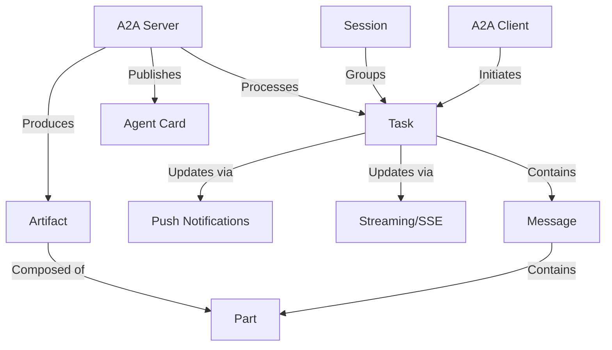
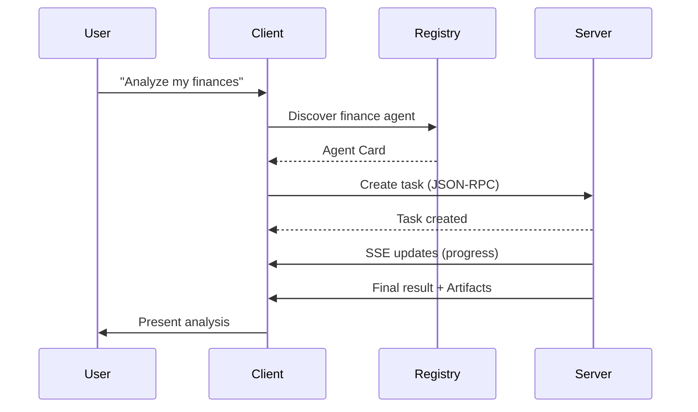

# A2A Protocol
## Agent-to-Agent Communication Framework

<!-- This is the title slide -->

---

# What is A2A?

A2A is a protocol that enables **interoperable communication between autonomous AI agents** from different systems and providers.

Think of A2A as the **"diplomatic language"** that allows AI agents to:
- Request assistance from each other
- Share information securely
- Coordinate on complex tasks
- Notify each other of progress or completion

---

# Key Goals of A2A

- **Interoperability**: Bridge the communication gap between different agentic systems
- **Collaboration**: Enable agents to delegate tasks and exchange context
- **Discovery**: Allow agents to find and understand capabilities of other agents
- **Flexibility**: Support various interaction modes (sync, streaming, async)
- **Security**: Facilitate secure communication suitable for enterprise environments
- **Asynchronicity**: Support long-running tasks and human-in-the-loop scenarios

---

# Guiding Principles

<div class="columns">

<div>

### Simple
- Reuse existing standards
- HTTP, JSON-RPC 2.0, Server-Sent Events

### Enterprise Ready
- Addresses auth, security, privacy
- Aligns with established practices

### Async First
- Designed for long-running tasks
- Supports human-in-the-loop scenarios

</div>

<div>

### Modality Agnostic
- Text, audio/video, structured data
- Potential embedded UI components

### Opaque Execution
- Collaboration based on declared capabilities
- No need to share internal implementation

</div>

</div>

---

# Core Concepts: Visual Overview



---

# Core Concepts: Key Definitions

- **A2A Client**: Application/agent that initiates requests to an A2A Server
- **A2A Server**: Agent that exposes an A2A-compliant HTTP endpoint
- **Agent Card**: JSON metadata document describing identity, capabilities, endpoint
- **Task**: Fundamental unit of work with unique ID and defined lifecycle
- **Message**: Communication turn within a Task (user/agent role)
- **Part**: Smallest content unit (TextPart, FilePart, DataPart)
- **Artifact**: Output generated by the agent as result of a task

---

# Communication Flow Analogy

Think of A2A communication like a professional work request:

1. **Finding an expert** (Agent Card): Looking up a specialist in a directory
2. **Making a request** (Task creation): Submitting a work order
3. **Conversations** (Messages): Back-and-forth clarifications
4. **Deliverables** (Artifacts): Final products of the work
5. **Status updates** (Streaming/Push): Progress notifications

---

# Transport and Format

- **Transport Protocol**: HTTP(S) for all communication
- **Data Format**: JSON-RPC 2.0 for requests and responses
  - Content-Type: `application/json`
- **Streaming**: Server-Sent Events (SSE) for real-time updates
  - Content-Type: `text/event-stream`
  - Each SSE data field contains a complete JSON-RPC 2.0 Response

---

# Authentication and Authorization

<div class="columns">

<div>

### Transport Security
- Production MUST use HTTPS
- Modern TLS (1.2+) recommended

### Server Identity Verification
- Clients verify server via TLS certificate

### Client Authentication Process
1. Discover requirements from Agent Card
2. Obtain credentials out-of-band
3. Transmit in HTTP headers

</div>

<div>

### Server Responsibilities
- Authenticate every request
- Use standard HTTP status codes
- Include relevant headers for challenges

### In-Task Authentication
- Request via `input-required` state
- Client provides secondary credentials

### Authorization
- Based on authenticated identity
- Implementation-specific policies

</div>

</div>

---

# Agent Discovery: The Agent Card

```json
{
  "name": "Financial Analysis Agent",
  "version": "1.0.0",
  "endpoint": "https://finance-agent.example.com/a2a",
  "authentication": {
    "scheme": "Bearer",
    "scope": "finance.read finance.analyze"
  },
  "skills": [
    {
      "id": "market-analysis",
      "name": "Market Analysis",
      "description": "Analyzes market trends and stock performance"
    }
  ]
}
```

---

# Agent Card Discovery Mechanisms

- **Well-Known URI**: `https://{server_domain}/.well-known/agent.json`
- **Registries/Catalogs**: Curated directories of agents
  - Enterprise-specific
  - Public
  - Domain-specific
- **Direct Configuration**: Pre-configured with card URL or content

---

# Agent Card Security

- Agent Cards may contain sensitive information
- If sensitive, endpoint MUST be protected:
  - mTLS
  - Network restrictions
  - Authentication required to fetch the card
- NOT RECOMMENDED to include plaintext secrets
- Prefer dynamic credentials obtained out-of-band

---

# A2A in Action: Example Scenario



---

# Implementation Considerations

- Start with the most essential components
- Prioritize security from the beginning
- Consider how to handle task lifecycle transitions
- Plan for error handling and recovery
- Think about scalability for long-running tasks
- Design for observability (logging, monitoring)

---

# Thank You!

## Questions?

For more information:
- [A2A Specification Document]
- [Implementation Examples]
- [Development Resources]