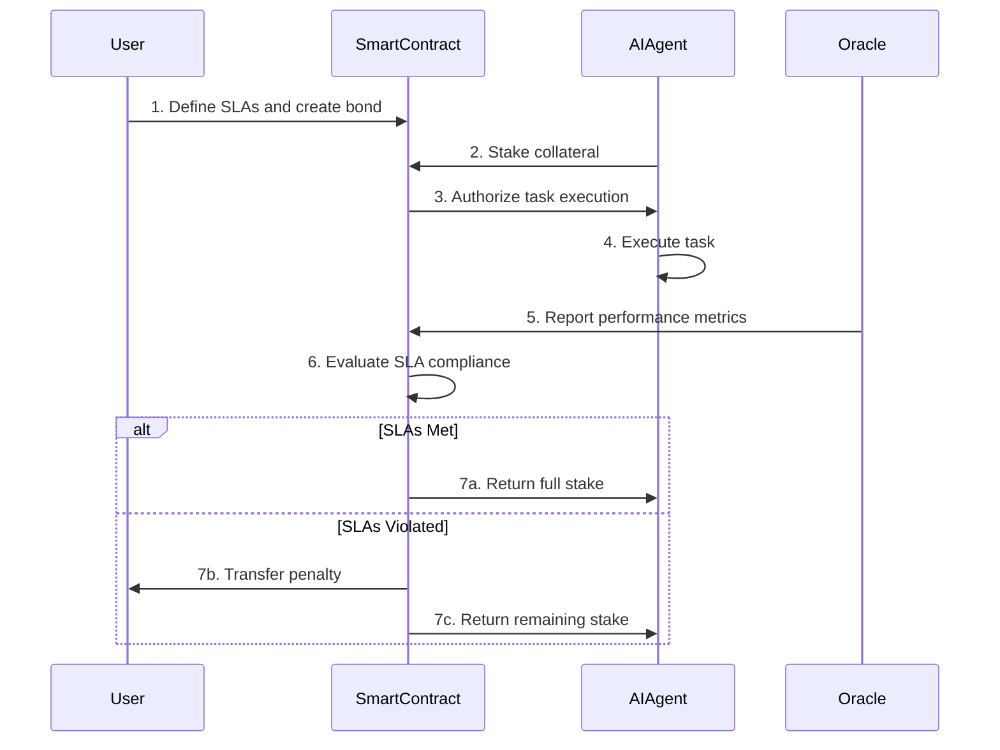
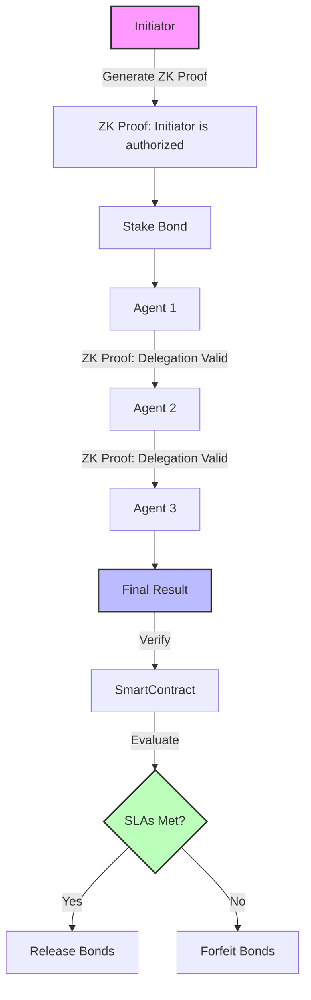

# Ensuring Trust and Privacy in AI Agent Systems: Using Blockchain Smart Contracts, Performance Bonds, and Zero-Knowledge Proofs

In today's AI-driven ecosystem, organizations increasingly rely on intelligent agents to execute complex tasks with minimal human oversight. While this automation brings tremendous efficiency benefits, it also introduces a critical challenge: **how can users trust that AI agents will deliver results according to predefined quality, timeliness, and compliance requirements?**

I'll explore an innovative approach combining blockchain technology, performance bonds, and zero-knowledge proofs to establish verifiable trust in AI agent systems - particularly in multi-agent workflows where ensuring accountability throughout the entire chain of delegation is paramount.

## The Trust Problem with AI Agents

When delegating tasks to AI agents, users face several trust challenges:

🔍 **Performance Reliability**: Will the agent complete tasks according to specified standards?
🔍 **Result Verification**: Can users verify the correctness of agent-produced outputs?
🔍 **Security and Compliance**: Will agent operations adhere to regulatory and security requirements?
🔍 **Delegation Accountability**: When multiple agents collaborate, who's ultimately responsible?

Traditional approaches to these challenges rely primarily on centralized monitoring, reputation systems, or manual oversight - all of which suffer from scalability issues, single points of failure, or high operational costs.

## Blockchain-Based Performance Bonds: Economic Incentives for Trust

A performance bond is a mechanism where an agent (or its provider) stakes a predetermined amount of value before task execution. Think of it as "skin in the game" that aligns incentives between the agent and the user:

```
If agent meets obligations → full bond returned
If agent fails → part or all of bond forfeited as compensation
```

This model mirrors traditional financial performance bonds but adapts them for the digital realm of AI services. By implementing these bonds on a blockchain, we gain several key advantages over traditional legal contracts:

• **Immutable Record**: The blockchain creates a permanent, tamper-proof record of all transactions and agreement terms
• **Automated Execution**: The terms execute automatically when conditions are met without third-party intervention
• **Transparent Verification**: All parties can independently verify the status and history of the bond

### Key Benefits of Blockchain-Based Performance Bonds for AI Deployments

1. **Aligned Incentives**: By risking tangible value (such as cryptocurrency), agent providers are motivated to deliver high-quality service
2. **Automated Enforcement**: Smart contracts on the blockchain can evaluate performance against objective metrics
3. **Regulatory Compliance**: Provides quantifiable assurance mechanisms for regulated industries
4. **Reduced Dispute Costs**: Clear, machine-enforced criteria mitigate the need for legal interventions

## Smart Contracts on Blockchain: The Enforcement Engine

A smart contract is a self-executing program that runs on a blockchain network. Unlike traditional contracts written in legal language and enforced by courts, smart contracts are written in code and enforced automatically by the blockchain itself. They serve as the core mechanism transforming an agreement between an AI agent and a user into an immutable, transparent, and self-executing protocol.



The diagram above illustrates the flow of a performance bond implemented through a blockchain smart contract. The smart contract defines:

• Identities of all involved parties
• Service level objectives (SLOs) the agent must meet
• Conditions for locking, releasing, or forfeiting collateral

This creates a trustless interaction pattern that follows a clear lifecycle:

1. **Initialization and Collateral Locking**: The agent deposits a predetermined stake (cryptocurrency or tokens) into the contract's escrow
2. **Task Execution and Monitoring**: Performance metrics are ingested via oracles (trusted data feeds) or on-chain events
3. **Automated Settlement**: The contract evaluates metrics against SLO thresholds to determine bond outcomes

### A Simple Performance Bond Smart Contract Example for Solana

Here's a simplified example of what a performance bond smart contract might look like for an AI agent task, implemented on the Solana blockchain using Rust:

```rust
// Simplified Solana program for AI agent performance bonds
use solana_program::{
    account_info::{next_account_info, AccountInfo},
    entrypoint,
    entrypoint::ProgramResult,
    msg,
    program::{invoke, invoke_signed},
    program_error::ProgramError,
    pubkey::Pubkey,
    system_instruction,
};

// Define the state for our performance bond
#[derive(Clone, Debug, PartialEq)]
pub struct PerformanceBond {
    pub owner: Pubkey,              // The user requesting the AI service
    pub agent_provider: Pubkey,     // The AI agent provider
    pub bond_amount: u64,           // Amount staked as collateral (in lamports)
    pub min_accuracy: u8,           // Minimum required accuracy (0-100)
    pub max_latency: u64,           // Maximum allowed latency in milliseconds
    pub oracle: Pubkey,             // Oracle that provides performance metrics
    pub task_completed: bool,       // Whether the task has been completed
    pub bond_released: bool,        // Whether the bond has been released
}

// Program entrypoint
entrypoint!(process_instruction);

// Process instructions sent to the program
fn process_instruction(
    program_id: &Pubkey,
    accounts: &[AccountInfo],
    instruction_data: &[u8],
) -> ProgramResult {
    // Parse instruction type from the first byte
    let instruction = instruction_data[0];
    
    match instruction {
        // Initialize a new performance bond
        0 => {
            msg!("Instruction: Initialize Performance Bond");
            let accounts_iter = &mut accounts.iter();
            
            let bond_account = next_account_info(accounts_iter)?;
            let owner = next_account_info(accounts_iter)?;
            let agent_provider = next_account_info(accounts_iter)?;
            let oracle = next_account_info(accounts_iter)?;
            let system_program = next_account_info(accounts_iter)?;
            
            // Extract parameters from instruction data
            let min_accuracy = instruction_data[1];
            let max_latency = u64::from_le_bytes(instruction_data[2..10].try_into().unwrap());
            let bond_amount = u64::from_le_bytes(instruction_data[10..18].try_into().unwrap());
            
            // Ensure the agent provider sent enough lamports
            if **agent_provider.lamports.borrow() < bond_amount {
                return Err(ProgramError::InsufficientFunds);
            }
            
            // Transfer lamports from agent_provider to bond_account
            invoke(
                &system_instruction::transfer(
                    agent_provider.key,
                    bond_account.key,
                    bond_amount,
                ),
                &[agent_provider.clone(), bond_account.clone(), system_program.clone()],
            )?;
            
            // Initialize the bond state
            let performance_bond = PerformanceBond {
                owner: *owner.key,
                agent_provider: *agent_provider.key,
                bond_amount,
                min_accuracy,
                max_latency,
                oracle: *oracle.key,
                task_completed: false,
                bond_released: false,
            };
            
            // Store state in bond_account (simplified)
            // In a real implementation, we'd serialize the struct properly
            msg!("Performance bond initialized successfully");
            Ok(())
        },
        
        // Mark task as completed and evaluate performance
        1 => {
            msg!("Instruction: Complete Task and Evaluate");
            let accounts_iter = &mut accounts.iter();
            
            let bond_account = next_account_info(accounts_iter)?;
            let agent_provider = next_account_info(accounts_iter)?;
            let owner = next_account_info(accounts_iter)?;
            let oracle = next_account_info(accounts_iter)?;
            
            // Verify the caller is the agent provider
            if agent_provider.key != &agent_provider.key {
                return Err(ProgramError::InvalidAccountData);
            }
            
            // In a real implementation, we'd deserialize the bond state
            // and check if task_completed is already true
            
            // Get metrics from oracle (simplified)
            // In a real implementation, we'd call the oracle program
            let accuracy: u8 = 96;  // Example value - would come from oracle
            let latency: u64 = 250; // Example value - would come from oracle
            
            // For this example, assume min_accuracy = 95 and max_latency = 300
            let min_accuracy = 95;
            let max_latency = 300;
            let bond_amount = 1_000_000; // lamports
            
            let meets_sla = accuracy >= min_accuracy && latency <= max_latency;
            
            if meets_sla {
                // Return full bond to agent provider
                **bond_account.try_borrow_mut_lamports()? -= bond_amount;
                **agent_provider.try_borrow_mut_lamports()? += bond_amount;
                msg!("SLA met: Full bond returned to agent provider");
            } else {
                // Calculate penalty (simplified - just 50% for any violation)
                let penalty = bond_amount / 2;
                let remainder = bond_amount - penalty;
                
                // Transfer penalty to owner and remainder to agent
                **bond_account.try_borrow_mut_lamports()? -= bond_amount;
                **owner.try_borrow_mut_lamports()? += penalty;
                **agent_provider.try_borrow_mut_lamports()? += remainder;
                
                msg!("SLA not met: Penalty applied");
            }
            
            // In a real implementation, we'd update and serialize the bond state
            // to mark task_completed and bond_released as true
            
            Ok(())
        },
        
        // Unknown instruction
        _ => {
            msg!("Error: Unknown instruction");
            Err(ProgramError::InvalidInstructionData)
        }
    }
}
```

This Solana program demonstrates the core features of a blockchain-based performance bond:

1. **Bond Initialization**: The agent provider deposits lamports (Solana's cryptocurrency units) as collateral
2. **SLA Metrics**: The contract defines clear requirements for accuracy and latency
3. **Oracle Integration**: Performance metrics are retrieved from an oracle (a trusted data provider)
4. **Automated Settlement**: Based on performance against SLAs, the program either:
   - Returns the full bond to the agent provider if metrics are met
   - Transfers a penalty to the client and returns the remainder if metrics are not met

While simplified, this example shows how Solana's blockchain provides a transparent and automated way to enforce performance guarantees for AI agent tasks without requiring trust between parties.


This smart contract demonstrates several key features of blockchain-based performance bonds:

1. The bond amount is locked in the contract at creation
2. The SLA requirements (accuracy and latency) are clearly defined
3. An oracle provides objective performance metrics
4. The bond is automatically settled based on those metrics
5. All transactions are recorded on the blockchain for transparency

## Zero-Knowledge Proofs: Privacy with Verification on Blockchain

While blockchain-based smart contracts and performance bonds create accountability, they don't inherently protect privacy. All data on a public blockchain is visible to everyone, which can be problematic for sensitive business operations. This is where zero-knowledge proofs (ZKPs) enter the picture.

A zero-knowledge proof allows one party (the prover) to prove to another (the verifier) that they know a value or have performed a specific action without revealing any additional information. This cryptographic technique enables privacy-preserving verification crucial for enterprise AI systems.

### Intuitive Understanding of Zero-Knowledge Proofs

Think of a zero-knowledge proof like proving you know the password to an account without actually sharing the password. You can demonstrate you have the correct credentials without revealing what those credentials actually are.

For AI agents on blockchain networks, ZKPs enable:

🔐 Verifying an agent's authorization without exposing its identity
🔐 Confirming input data meets requirements without revealing the data itself
🔐 Validating computation results without disclosing proprietary algorithms

## Multi-Agent Trust Chains: Combining Blockchain, Performance Bonds, and ZKPs

The most compelling application combines blockchain-based performance bonds and zero-knowledge proofs to create trusted multi-agent workflows:



As shown in the diagram above, this approach addresses three key challenges:

1. **Identity Verification**: Ensuring the initiator of agent work has a recognized identity without revealing it
2. **Service Level Guarantees**: Establishing contracts with specific SLAs guaranteed through staked cryptocurrency
3. **Chain of Custody**: Verifying each link in a multi-agent workflow maintains accountability

Here's how this works in practice:

The initiating agent generates a zero-knowledge proof demonstrating they're authorized by a trusted entity without revealing the entity's identity. Each subsequent agent in the chain appends their delegation to a verifiable trail recorded on the blockchain, with each referencing the original proof.

The blockchain smart contract verifies that:
• The originator has proper authorization (via ZKP)
• The delegation chain is intact and valid
• The required stake is locked as collateral

This creates end-to-end accountability while preserving privacy.

## Advanced Implementation Example: Solana Blockchain

Here's a more advanced implementation example that combines performance bonds and zero-knowledge proofs on the Solana blockchain:

```javascript
// Simplified example using solana-agent-kit
import { Connection, PublicKey } from '@solana/web3.js';
import { AgentClient, EscrowService, PerformanceOracle, ZKProofVerifier } from 'solana-agent-kit';

const connection = new Connection('https://api.mainnet-beta.solana.com');
const programId = new PublicKey('YourEscrowProgramID');

const agentClient = new AgentClient(connection, programId);
const escrow = new EscrowService(connection, programId);
const oracle = new PerformanceOracle(connection, programId);
const zkVerifier = new ZKProofVerifier(connection, programId);

async function runMultiAgentWorkflowWithBond(taskData, delegationChain, rootProof) {
  // 1. Verify the root agent authorization using ZK proof
  const isRootValid = await zkVerifier.verifyProof(rootProof);
  if (!isRootValid) throw new Error("Root agent not properly authorized");
  
  // 2. Verify delegation chain integrity
  const isValidChain = await zkVerifier.verifyDelegationChain(delegationChain);
  if (!isValidChain) throw new Error("Delegation chain is invalid");
  
  // 3. Lock collateral for performance bond
  const bondAmount = 1_000_000; // lamports (Solana's cryptocurrency unit)
  await escrow.lockCollateral(agentClient.agentPubkey, bondAmount);
  
  // 4. Execute AI task
  const result = await agentClient.executeTask({ taskData });
  
  // 5. Gather performance metrics
  const { accuracy, latency, completeness } = await oracle.fetchMetrics(agentClient.agentPubkey);
  
  // 6. Settle collateral based on SLO
  const meetsSLO = result.success && accuracy >= 0.95 && latency <= 300 && completeness >= 0.9;
  if (meetsSLO) {
    await escrow.releaseCollateral(agentClient.agentPubkey);
    return { status: "success", result, metrics: { accuracy, latency, completeness } };
  } else {
    // Calculate penalty based on severity of SLO violation
    const penaltyAmount = calculatePenalty(bondAmount, accuracy, latency, completeness);
    await escrow.forfeitCollateral(agentClient.agentPubkey, taskData.userPubkey, penaltyAmount);
    return { status: "failed", result, metrics: { accuracy, latency, completeness } };
  }
}

function calculatePenalty(bondAmount, accuracy, latency, completeness) {
  // Example penalty calculation based on SLO violations
  let penalty = 0;
  
  if (accuracy < 0.95) {
    const accuracyShortfall = 0.95 - accuracy;
    penalty += bondAmount * (accuracyShortfall / 0.95) * 0.5;
  }
  
  if (latency > 300) {
    const latencyExcess = (latency - 300) / 300;
    penalty += bondAmount * Math.min(latencyExcess, 1) * 0.3;
  }
  
  if (completeness < 0.9) {
    const completenessShortfall = 0.9 - completeness;
    penalty += bondAmount * (completenessShortfall / 0.9) * 0.2;
  }
  
  return Math.min(Math.round(penalty), bondAmount);
}
```

This implementation showcases how to combine ZK proofs for authorization verification with performance bonds for SLA enforcement in a multi-agent workflow on the Solana blockchain.

## Practical Use Cases for Blockchain-Based AI Trust Systems

### Automated Service Agreements

Imagine a freelance AI agent that performs sentiment analysis for a client. Before starting the task, the AI provider stakes a predefined amount of cryptocurrency in a blockchain smart contract. The service is monitored in real-time via oracles reporting on metrics like accuracy and response time. Upon successful completion meeting the agreed performance criteria, the smart contract releases the stake back to the provider. If performance falls short, a portion of the stake transfers to the client as compensation.

### Multi-Agent Supply Chain Workflows

In a supply chain scenario, each agent involved (from sourcing to shipping) signs a delegation record on the blockchain and provides a zero-knowledge proof of legitimacy and prior stake. At any point, auditors can verify that the initiating entity had sufficient economic skin in the game and that the entire execution chain was valid—without revealing the identities of intermediaries.

### Decentralized Financial Services

For automated portfolio management, an agent must lock collateral in a blockchain smart contract before executing trades. Using zero-knowledge proofs ensures that even though trades are performed autonomously, users can verify the agent's authorization and compliance with agreed strategies without disclosing proprietary trading logic.

## Comparing Traditional and Blockchain-Based Trust Models

| Aspect | Traditional Trust Models | Blockchain-Based Trust Models |
|--------|--------------------------|-------------------------------|
| **Enforcement** | Manual, legal process | Automated via smart contracts |
| **Transparency** | Limited, often black-box | Fully transparent execution |
| **Verification** | Centralized authority | Decentralized consensus |
| **Privacy** | Often sacrificed for verification | Preserved through ZKPs |
| **Cost** | High dispute resolution costs | Low operational costs |
| **Scalability** | Limited by human oversight | Highly scalable through automation |

## Conclusion and Future Directions

The integration of performance bonds and zero-knowledge proofs through blockchain-based smart contracts creates a powerful framework for establishing trust in AI agent systems. This approach:

• Aligns economic incentives through cryptocurrency-backed performance bonds
• Protects privacy via zero-knowledge proofs
• Automates enforcement through blockchain smart contracts
• Creates verifiable delegation chains for multi-agent workflows

As these blockchain technologies mature, they'll become essential components for scaling trusted AI systems across organizational boundaries. The ability to maintain accountability and privacy simultaneously opens new possibilities for autonomous AI collaboration without sacrificing security or compliance.

The convergence of these technologies raises important questions about the nature of agency and responsibility in multi-agent systems. Can we establish clear lines of accountability in increasingly complex agent interactions? How will regulatory frameworks evolve to address these new models of automated trust? These questions will shape the future development of trustworthy AI agent ecosystems.

By embracing these blockchain-based trust mechanisms, we can build AI systems that are not only more capable but also more trustworthy, transparent, and privacy-preserving - essential qualities for the next generation of autonomous technologies.

## Bibliography

1. **Zero-Knowledge Proofs, Blockchain and the Future of Personal Data in the Age of Agentic AI** (BigDATAwire, 2025)
   [https://www.bigdatawire.com/2025/04/02/zero-knowledge-proofs-blockchain-and-the-future-of-personal-data-in-the-age-of-agentic-ai/](https://www.bigdatawire.com/2025/04/02/zero-knowledge-proofs-blockchain-and-the-future-of-personal-data-in-the-age-of-agentic-ai/)
   
   Explores how Midnight is developing a data protection blockchain using zero-knowledge proofs to enable businesses and customers to conduct data-enabled commerce while maintaining privacy, with implications for agentic AI systems.

2. **Building trust in AI with Zero-Knowledge Proofs** (LinkedIn, 2023)
   [https://www.linkedin.com/pulse/building-trust-ai-zero-knowledge-proofs-zkp-anthony-butler](https://www.linkedin.com/pulse/building-trust-ai-zero-knowledge-proofs-zkp-anthony-butler)
   
   Discusses how zero-knowledge proofs can be used to build trust in AI systems by allowing verification of model integrity without exposing sensitive information, particularly relevant for credit scoring and other decision systems.

3. **Why Zero-Knowledge Proofs Are the Future of Blockchain Security** (Built In, 2025)
   [https://builtin.com/articles/zero-knowledge-proof-blockchain-security](https://builtin.com/articles/zero-knowledge-proof-blockchain-security)
   
   Examines how zero-knowledge proofs enhance blockchain security while preserving privacy, explaining their importance in creating secure systems that don't compromise on transparency or confidentiality.

4. **Zero-Knowledge Proofs: Shaping AI Privacy & Security** (Dialzara, 2024)
   [https://dialzara.com/blog/zero-knowledge-proofs-shaping-ai-privacy-and-security/](https://dialzara.com/blog/zero-knowledge-proofs-shaping-ai-privacy-and-security/)
   
   Analyzes how ZKPs improve privacy for AI algorithms, secure transactions on blockchain networks, and protect proprietary AI models while addressing technical implementation challenges.

5. **Trustworthy Cloud Service Level Agreement Enforcement with Blockchain Based Smart Contract** (IEEE, 2018)
   [https://ieeexplore.ieee.org/document/8591026/](https://ieeexplore.ieee.org/document/8591026/)
   
   Presents a witness model for credibly enforcing cloud service level agreements using blockchain-based smart contracts, with game theory applied to ensure truthful reporting by witnesses.

6. **Non-Interactive Zero-Knowledge for Blockchain: A Survey** (ResearchGate, 2020)
   [https://www.researchgate.net/publication/347930737_Non-Interactive_Zero-Knowledge_for_Blockchain_A_Survey](https://www.researchgate.net/publication/347930737_Non-Interactive_Zero-Knowledge_for_Blockchain_A_Survey)
   
   Comprehensive survey of non-interactive zero-knowledge argument schemes and their applications in confidential transactions and private smart contracts on blockchain.